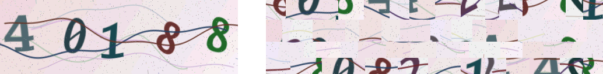

# strip-captcha

A numeric captcha for sign-up forms. The Go server draws the code, cuts the
image into tiles and sends them shuffled. The React component puts the tiles
back in order with CSS.



Left: what the user sees. Right: the PNG the browser actually downloads.

## How it works

1. **Rendering.** The code comes from `crypto/rand`. Each digit gets its own
   font, size, rotation, shear and stretch. Two dark curves as thick as the
   digit strokes cross the code, then the whole image is warped with sine
   waves and sprinkled with noise.
2. **Tiling.** The image is cut into 3–4 rows of random height, and each row
   into tiles 12–28 px wide. Rows have different cut points, so no seam runs
   through the whole image. Tiles are shuffled within rows, rows are shuffled,
   and tiles from a second image with a different code are mixed in as decoys.
3. **Assembly.** The client gets the atlas and a list of tiles
   `[x, y, w, h, sx, sy]` and positions each one with `background-position`.
   The assembled image only exists on screen.
4. **Verification.** The answer is stored and checked on the server only. A
   captcha can be used once, even if the answer was wrong. Answers faster than
   2 s are rejected, and each client can request a limited number of captchas.
   Optionally, the answer is accepted only from the client that requested it.

### Limitations

The tile list comes in the same response as the atlas, so a bot written
specifically for this captcha can reassemble the image. Tiling stops generic
solvers that grab the captcha image and send it to OCR or a solving service.
Against a targeted bot you have the distortions, single use, the minimum
solve time and rate limits. That is enough to stop bulk sign-ups but will not
stop a determined attacker; combine it with other server-side checks (IP and
email rate limits, disposable domain filters).

The captcha is visual only. Give users who can't see it another way in, such
as email confirmation or OAuth.

## Server (Go 1.22+)

```sh
go get github.com/famfamfam/strip-captcha@latest
```

```go
import stripcaptcha "github.com/famfamfam/strip-captcha"

captcha, err := stripcaptcha.New(stripcaptcha.NewMemoryStore(), stripcaptcha.Options{})
if err != nil {
	log.Fatal(err)
}

// Issues captchas as JSON in the format the component expects
mux.Handle("GET /api/captcha", captcha.Handler(nil))

// In your form handler
err = captcha.Verify(ctx, stripcaptcha.RemoteIP(r), req.CaptchaID, req.CaptchaAnswer)
switch {
case errors.Is(err, stripcaptcha.ErrInvalid):
	// 400: wrong, expired or reused; the client should fetch a new captcha
case err != nil:
	// 500: store failure
}
```

You can skip `Handler`, call `captcha.Generate(ctx, clientKey)` yourself and
send the returned `*Challenge` as JSON. `ErrRateLimited` maps to 429.

**Behind a proxy**, pass the real client IP to `Handler` and `Verify`.
`RemoteIP` returns the proxy address, which puts every client under one
shared limit. Only read `X-Forwarded-For` if your proxy sets it, since
clients can send it themselves.

### Storage

`NewMemoryStore()` works for a single process. For several server instances
use Redis 6.2+:

```go
import "github.com/famfamfam/strip-captcha/redisstore"

store := redisstore.New(redis.NewClient(&redis.Options{Addr: "localhost:6379"}))
captcha, err := stripcaptcha.New(store, stripcaptcha.Options{})
```

For other backends, implement `Store` (`Save` and an atomic `Take`) and,
for rate limiting, `Counter` (`Incr`).

### Options

| Field | Default | Description |
|---|---|---|
| `Width`, `Height` | 204×64 | Size on the page, CSS px |
| `Length` | 5 | Number of digits, 3–10 |
| `Scale` | 2 | Pixel density of the PNG. 1 halves the size but looks blurry on HiDPI screens |
| `TTL` | 10 min | Captcha lifetime |
| `MinSolveTime` | 2 s | Faster answers are rejected. Negative disables the check |
| `RateLimit`, `RateWindow` | 30 per 10 min | Captchas per client. Negative `RateLimit` disables the limit |
| `BindClient` | false | Accept the answer only from the client the captcha was issued to. Makes forwarding to solving services harder, but rejects mobile users whose IP changed |
| `NoDecoys` | false | Don't mix decoy tiles into the atlas. Smaller image, but the raw PNG contains only the real digits |
| `KeyPrefix` | `captcha:` | Key prefix in the store |

The image is about 35 KB with the defaults.

## Client (React 18+)

```sh
npm install github:famfamfam/strip-captcha#v0.1.3
```

npm builds the package on install (the `prepare` script).

```tsx
import { StripCaptcha, type StripCaptchaValue } from 'strip-captcha';
import 'strip-captcha/styles.css'; // optional

function SignUpForm() {
  const [captcha, setCaptcha] = useState<StripCaptchaValue | null>(null);
  const [captchaEnabled, setCaptchaEnabled] = useState(true);
  const [reloadKey, setReloadKey] = useState(0);

  async function submit() {
    const res = await api.signUp({ ...fields, captcha_id: captcha?.id, captcha_answer: captcha?.answer });
    // Each captcha is single-use, so fetch a new one after a rejection
    if (!res.ok) setReloadKey((k) => k + 1);
  }

  return (
    <form onSubmit={submit}>
      {/* ...other fields... */}
      <StripCaptcha
        fetchChallenge={() => fetch('/api/captcha').then((r) => (r.ok ? r.json() : null))}
        onChange={setCaptcha}
        onAvailabilityChange={setCaptchaEnabled}
        reloadKey={reloadKey}
      />
      <button disabled={captchaEnabled && !captcha}>Sign up</button>
    </form>
  );
}
```

`onChange` receives `{ id, answer }` once all digits are entered and `null`
otherwise. Arabic, Persian and full-width digits are converted to ASCII and
everything else is dropped. The component fetches a new captcha shortly
before the current one expires.

If the captcha can be switched off in your settings, have the server respond
with `{ "enabled": false }`. The component then renders nothing and calls
`onAvailabilityChange(false)`.

### Props

| Prop | Description |
|---|---|
| `fetchChallenge` | `() => Promise<response \| null>`. `null` or a rejected promise shows a load error |
| `onChange` | `(value: { id, answer } \| null) => void` |
| `onAvailabilityChange` | `(enabled: boolean) => void` |
| `reloadKey` | Change it to fetch a new captcha |
| `autoRefresh` | Refresh before expiry. Default `true` |
| `labels` | `label`, `placeholder` (`{n}` is the digit count), `refresh`, `loadError`, `imageAlt` |
| `classNames` | Extra classes for `root`, `label`, `row`, `image`, `status`, `refresh`, `input`, e.g. Tailwind |
| `refreshIcon`, `loadingIndicator` | Custom icons |
| `inputProps` | Extra input attributes (`name`, `autoFocus`, …) |

To build your own UI, use `useStripCaptcha({ fetchChallenge, reloadKey })`,
which returns `{ status, challenge, refresh }`, and
`<StripCaptchaImage challenge={...} />` for the image.

The default styles in `strip-captcha/styles.css` read CSS variables
(`--strip-captcha-border`, `--strip-captcha-bg`, `--strip-captcha-focus` and
others) that you can override on `.strip-captcha`.

## Demo

```sh
npm install && npm run build
go run ./examples/server
# http://localhost:8080
```

## Development

```sh
go test ./...
STRIPCAPTCHA_REDIS=localhost:6379 go test ./redisstore
npm test
STRIPCAPTCHA_DUMP=/tmp/samples go test -run TestDumpSamples  # writes sample images and atlases
```

## License

[MIT](LICENSE). Use it for anything, just keep the copyright notice.
